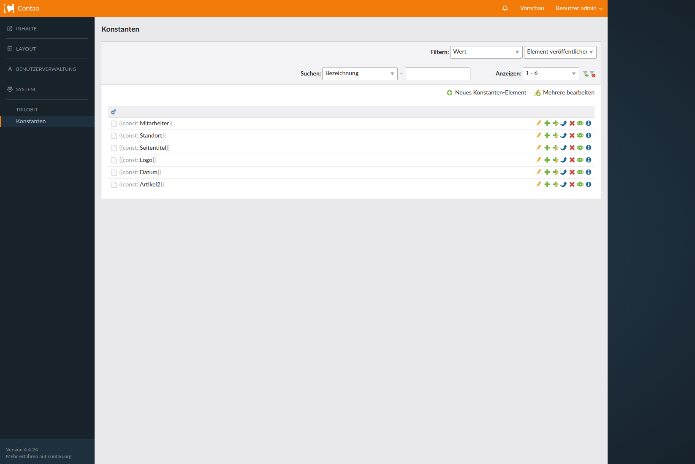
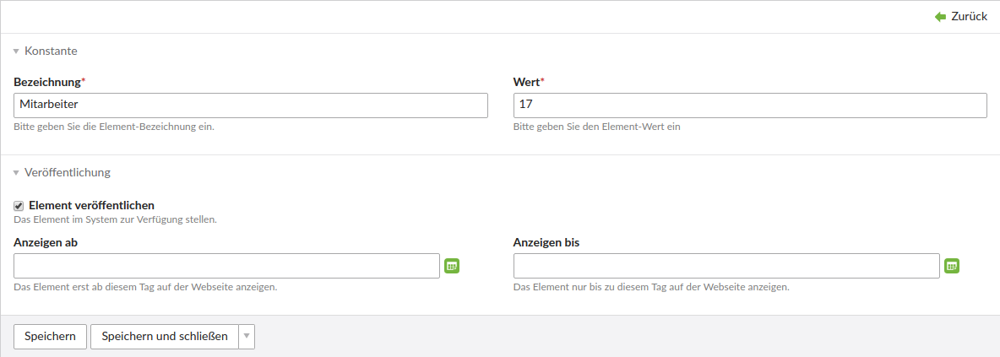
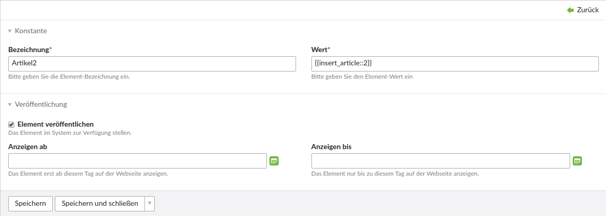
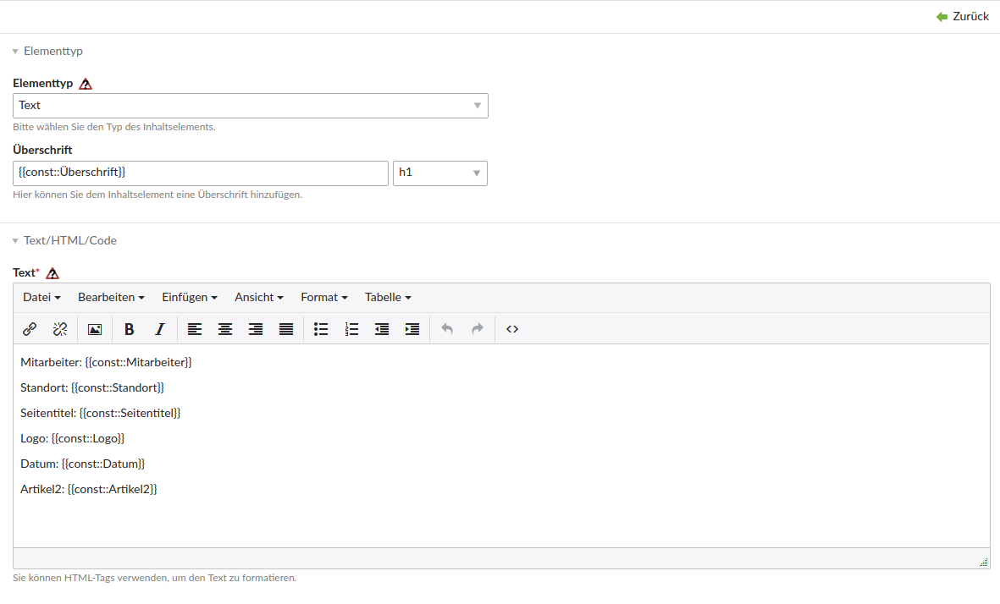
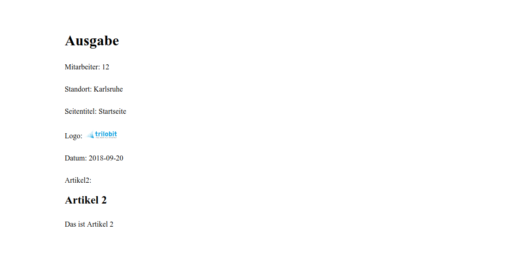

Constants Bundle
==============================================

Das Constants Bundle fügt dem Backend von Contao den Punkt Konstanten hinzu, wo Sie mit einer Bezeichnung und einem dazugehörenden Wert eine oder mehrere Konstanten festlegen können. Diese können dann wiederum durch einen Insert-Tag überall in ihrer Contao Installation eingefügt werden. Das hat den Vorteil das Sie bestimmte Werte an mehreren Stellen einfügen können, sie aber nicht mehr alle einzeln ändern müssen, sondern dies nun über den Punkt Konstanten machen könne. Zusätzlich ist es möglich Konstanten mit einem weiteren Insert-Tag statt eines Wertes anzulegen, wodurch das Einbinden von Bildern oder einzelnen Artikeln ermöglicht wird.


Aufbau
------

Damit die Erweiterung den Insert-Tag als solchen erkennen kann, muss eine bestimmte Struktur benutzt werden. Diese sieht wie folgt aus:
```{{const::Mitarbeiter}}```
Dies würde dann den angegebenen Wert der Konstante "Mitarbeiter" anzeigen.


Constants Bundle
==============================================

The Constants Bundle adds Constants to the backend of Contao, where you can specify one or more constants with a label and its associated value. These can then be inserted through an insert tag throughout your Contao installation. This has the advantage that you can insert certain values in several places, but you no longer have to change them all individually. In addition, it is possible to create constants with another insert tag instead of a value, which allows the inclusion of images or individual articles.


Structure
---------

For the extension to recognize the insert tag as such, a particular structure must be used. This could look like this:
```{{const::Employee}}```
This would then output the specified value of the constant "Employee".


Screenshots
-----------

Konstanten Übersicht / Constants overview


Einfache Konstante / Simple constant


Konstante mit einem Insert-Tag / Constant with an insert-tag


Konstante in einem Artikel / Constants in an article


Ausgabe der Konstante / Output of the constants


Installation
------------


Install the extension via composer: [trilobit-gmbh/contao-constants-bundle](https://packagist.org/packages/trilobit-gmbh/contao-constants-bundle).

Compatibility
-------------

- Contao version ~4.4
- Contao version ~4.9
